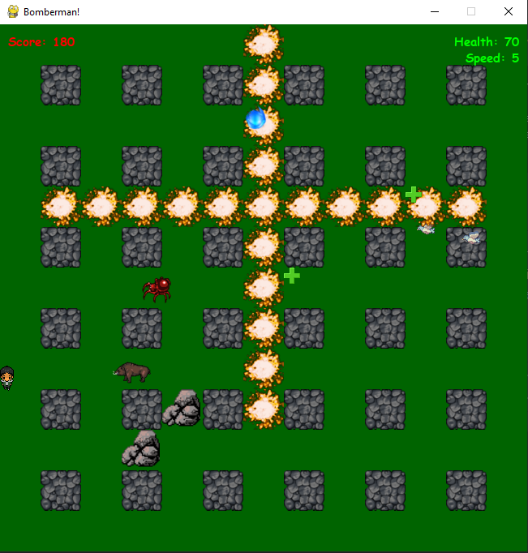

# Bomberman pygame application

Simple bomberman game with dynamic bombing planting and enemies spawning

## Installation

Python3 must be already installed

```shell
git clone https://github.com/denyslipin/bomberman.git
python3 -m venv venv
source venv/bin/activate - on macOS (venv\Scripts\activate - on Windows)
pip install -r requirements.txt
run from main.py
```

## Features

* Bomberman who runs from enemies and plants bombs
* Displaying statistics of score, health and speed
* Different kinds of animals (spiders, boars and birds)
* Different effects: healing, speeding and slowing

## Demo


